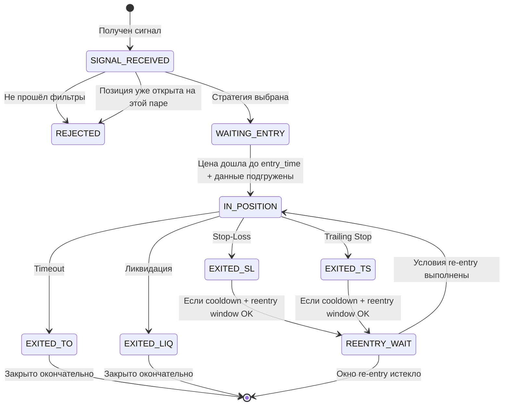

# 📘 Trading Bot Algorithm Specification v3.0

> **Назначение:** Полное описание алгоритмов для реального торгового бота.
> Основано на верифицированном бэктесте (`backtest_detailed.py`)
> и оптимизаторе (`optimize_unified.py` + `run_strategy_fast`).

---

## 1. Архитектура и подписки

### 1.1 Входные данные (подписки)

```
┌─────────────────────────────────────────────────┐
│                ВХОДНЫЕ ПОТОКИ                    │
├─────────────────────────────────────────────────┤
│  1. Сигналы (webhook / polling)                 │
│     → signal_id, pair, score, rsi, vol, oi,     │
│       signal_timestamp, entry_time              │
│                                                 │
│  2. 1-секундный агрегированный поток данных      │
│     (Binance aggTrades → агрегация в 1s bars)   │
│     Для каждого бара:                           │
│     → timestamp (epoch seconds)                 │
│     → close_price                               │
│     → delta (buy_volume − sell_volume)           │
│     → large_buy_count (сделки ≥ порог)          │
│     → large_sell_count (сделки ≥ порог)         │
└─────────────────────────────────────────────────┘
```

### 1.2 Подписка на рыночные данные

При **получении сигнала** бот должен:

1. **Подписаться** на aggTrades websocket для пары сигнала
2. **Загрузить историю** — минимум **`max(delta_window, 100)`** секунд агрегированных баров ДО момента `entry_time`
3. **Начать агрегацию** 1-секундных баров в реальном времени

> [!IMPORTANT]
> Lookback = `max(delta_window, 100)` баров. Нужно для двух вычислений:
> - `rolling_delta` — сумма delta за `delta_window` сек (до 3600 сек!)
> - `avg_delta` — средняя |delta| за 100 сек (порог для TS)
>
> Загрузив `max(delta_window, 100)` баров через API, мы гарантируем
> точные вычисления с первой секунды. Proportional scaling НЕ нужен.

### 1.3 Формат бара (1 секунда)

```
Bar = {
    ts: int,              # Unix epoch seconds
    price: float,         # close price за эту секунду
    delta: float,         # ВСЕХ buy_volume − ВСЕХ sell_volume (объём, не количество)
    large_buy_count: int, # количество КРУПНЫХ buy-сделок (> $10k USD)
    large_sell_count: int  # количество КРУПНЫХ sell-сделок (> $10k USD)
}

// ВАЖНО:
// delta = сумма ВСЕХ сделок за секунду (buy_vol - sell_vol), НЕ только крупных
// large_buy/sell_count = КОЛИЧЕСТВО сделок > $10k (используется ТОЛЬКО в re-entry)
// Это РАЗНЫЕ метрики, не путать!
```

---

## 2. Загрузка стратегии из JSON

### 2.1 Формат файла `composite_strategy.json`

```json
{
  "version": "3.0",
  "rules": [
    {
      "filter": {
        "score_min": 100,
        "score_max": 150,
        "rsi_min": 80,
        "vol_min": 0,
        "oi_min": 13
      },
      "strategy": {
        "leverage": 10,
        "sl_pct": 5,
        "delta_window": 3600,
        "threshold_mult": 1.0,
        "base_activation": 10.0,
        "base_callback": 3.0,
        "base_reentry_drop": 5.0,
        "base_cooldown": 600,
        "max_reentry_hours": 4,
        "max_position_hours": 24
      }
    }
  ]
}
```

### 2.2 Алгоритм выбора стратегии (match_signal → strategy)

```
FUNCTION match_signal(score, rsi, vol_zscore, oi_delta) → Strategy | NULL:

    FOR EACH rule IN rules (ordered by priority):
        IF score >= rule.score_min AND score < rule.score_max:
            IF rsi < rule.rsi_min:    → SKIP ("rsi too low")
            IF vol < rule.vol_min:    → SKIP ("vol too low")
            IF oi  < rule.oi_min:     → SKIP ("oi too low")
            RETURN rule.strategy      → ✅ MATCH
    
    RETURN NULL  → score не попал ни в один range
```

> [!NOTE]
> Диапазоны score **НЕ пересекаются** (100-150, 150-200, ...).
> Поиск всегда даёт 0 или 1 совпадение.

---

## 3. Параметры стратегии (справочник)

| Параметр | Тип | Описание | Пример |
|----------|-----|----------|--------|
| `leverage` | int | Плечо для позиции | 10 |
| `sl_pct` | float | Stop-loss по цене (%), НЕ по позиции | 3.0 |
| `delta_window` | int | Окно для rolling delta (секунды) | 3600 |
| `threshold_mult` | float | Множитель для порога delta | 1.0 |
| `base_activation` | float | Мин. profit% от entry для активации TS | 10.0 |
| `base_callback` | float | Мин. drawdown% от max для срабатывания TS | 3.0 |
| `base_reentry_drop` | float | Мин. падение% от max для re-entry | 5.0 |
| `base_cooldown` | int | Мин. секунд между exit и re-entry | 300 |
| `max_reentry_hours` | float | Окно re-entry от первого входа (часы) | 4 |
| `max_position_hours` | float | Макс. время одной позиции (часы) | 24 |

### 3.1 Производные константы (вычисляются при загрузке)

```
max_reentry_seconds  = max_reentry_hours × 3600
max_position_seconds = max_position_hours × 3600
liquidation_threshold = 100.0 / leverage    # например, 10% при lev=10
commission_cost = COMMISSION_PCT × 2 × leverage
    где COMMISSION_PCT = 0.04  (0.04% = taker fee)
    Пример: 0.04 × 2 × 10 = 0.8% от позиции
```

---

## 4. Жизненный цикл позиции

### 4.1 State Machine



### 4.2 Блокировка по паре (Position Tracking)

```
GLOBAL: active_positions = {}  // { symbol: last_exit_timestamp }

FUNCTION can_open_position(symbol, signal_timestamp):
    IF symbol IN active_positions:
        IF signal_timestamp < active_positions[symbol]:
            RETURN FALSE  // Позиция занята
    RETURN TRUE
```

> [!WARNING]
> **Одновременно на одной паре может быть только ОДНА позиция.**
> Новый сигнал на ту же пару отклоняется, если предыдущая позиция ещё не закрыта.

---

## 5. Алгоритм входа в позицию

### 5.1 Первичный вход

```
WHEN signal received:
    strategy = match_signal(score, rsi, vol, oi)
    IF strategy IS NULL → SKIP
    IF NOT can_open_position(symbol, signal_timestamp) → SKIP

    // Подгрузить 1s bars (lookback + live)
    subscribe_to_market_data(symbol)
    load_lookback_bars(symbol, count=100)  // 100 секунд до entry_time

    // Вход в позицию
    OPEN LONG(symbol, leverage=strategy.leverage)
    
    // Инициализация state:
    entry_price      = текущая рыночная цена
    max_price         = entry_price
    signal_start_ts   = entry_time (epoch)
    position_entry_ts = текущий timestamp
    in_position       = TRUE
    trade_count       = 1
```

---

## 6. Алгоритм мониторинга позиции (каждую секунду)

> Выполняется на каждом новом 1s баре, пока `in_position == TRUE`.

### 6.1 Порядок проверок (КРИТИЧЕСКИ ВАЖЕН!)

```
КАЖДУЮ СЕКУНДУ (новый bar):

    1. Обновить max_price
    2. Рассчитать pnl_from_entry и drawdown_from_max
    3. ПРОВЕРКА TIMEOUT        ← первый приоритет
    4. ПРОВЕРКА ЛИКВИДАЦИИ     ← второй приоритет
    5. ПРОВЕРКА STOP-LOSS      ← третий приоритет
    6. ПРОВЕРКА TRAILING-STOP  ← четвёртый приоритет
```

> [!CAUTION]
> **Порядок проверок НЕЛЬЗЯ менять!**
> Timeout проверяется ДО ликвидации, потому что при timeout
> тоже нужно проверить ликвидацию (цена могла упасть ниже порога).

### 6.2 Расчёт базовых метрик

```
// Обновляем максимальную цену
IF current_price > max_price:
    max_price = current_price

// PnL от цены входа (в % от цены, НЕ от позиции)
pnl_from_entry = (current_price - entry_price) / entry_price × 100

// Просадка от максимума (в %)
drawdown_from_max = (max_price - current_price) / max_price × 100
```

### 6.3 Проверка 1: TIMEOUT (max_position_seconds)

```
IF max_position_seconds > 0:
    IF (current_ts - position_entry_ts) >= max_position_seconds:

        // Даже при timeout проверяем ликвидацию!
        IF pnl_from_entry <= -liquidation_threshold:
            EXIT reason="LIQUIDATED+TIMEOUT"
            realized_pnl = -100%  // полная потеря
        ELSE:
            EXIT reason="TIMEOUT"
            realized_pnl = max(pnl_from_entry × leverage, -100%) - commission_cost
```

> [!NOTE]
> **max_position_seconds** считается от `position_entry_ts` текущего входа,
> НЕ от первого входа по сигналу. Каждый re-entry сбрасывает этот таймер.

### 6.4 Проверка 2: ЛИКВИДАЦИЯ

```
liquidation_threshold = 100.0 / leverage   // 10% при lev=10

IF pnl_from_entry <= -liquidation_threshold:
    EXIT reason="LIQUIDATED"
    realized_pnl = -100%   // полная потеря, комиссия не учитывается
```

### 6.5 Проверка 3: STOP-LOSS

```
IF pnl_from_entry <= -sl_pct:
    EXIT reason="SL"
    realized_pnl = max(pnl_from_entry × leverage, -100%) - commission_cost
```

> [!IMPORTANT]
> `sl_pct` — это процент падения **ЦЕНЫ**, не позиции!
> При sl_pct=3% и leverage=10: цена падает 3% → потеря 30% позиции.
> При sl_pct=10% и leverage=10: цена падает 10% → потеря 100% (=ликвидация).

### 6.6 Проверка 4: TRAILING STOP (главный алгоритм)

Trailing Stop (TS) — это интеллектуальный выход, основанный на 3 условиях:

```
IF pnl_from_entry >= base_activation         // Условие A: цена выросла достаточно
   AND drawdown_from_max >= base_callback:   // Условие B: начался откат

    // Условие C: проверяем momentum (delta)
    rolling_delta = sum(delta за последние delta_window секунд)
    avg_delta     = avg(|delta| за последние 100 секунд)
    threshold     = avg_delta × threshold_mult

    // Решение о выходе (proportional scaling НЕ нужен —
    // бот загружает достаточно истории через API)
    IF rolling_delta <= 0 AND rolling_delta <= threshold:
        EXIT reason="TRAILING"
        realized_pnl = max(pnl_from_entry × leverage, -100%) - commission_cost
```

#### Подробное объяснение условий TS:

| Условие | Параметр | Что проверяет |
|---------|----------|---------------|
| **A** | `base_activation` | Цена выросла на X% от входа. Пример: activation=10 → TS активируется только когда цена +10% |
| **B** | `base_callback` | Цена откатилась на Y% от максимума. Пример: callback=3 → после достижения пика, цена должна упасть на 3% |
| **C** | `delta_window` + `threshold_mult` | Rolling delta за окно отрицательна (продавцы доминируют) |

#### Логика выхода по TS:

```
Выход происходит когда ВСЕ ТРИ условия выполнены одновременно:
  ✅ A: Позиция в достаточном плюсе (≥ activation%)
  ✅ B: Начался откат от максимума (≥ callback%)
  ✅ C: Покупатели не поддерживают цену (rolling_delta ≤ 0 И ≤ threshold)

Если хотя бы одно НЕ выполнено — держим позицию. Примеры:
  ❌ Цена +15% от entry, но нет отката → НЕ выходим (B не выполнено)
  ❌ Откат 5% от max, но delta положительная → НЕ выходим (C не выполнено)
  ❌ Delta отрицательная, но цена ещё не достигла activation → НЕ выходим (A не выполнено)
```

#### Визуальная диаграмма TS:

```
Цена
  ↑
  │           ╭── max_price (recorded high)
  │          ╱  │
  │    ╭────╯   │← callback% от max
  │   ╱         ↓
  │  ╱    TS EXIT ← здесь если delta ≤ 0
  │ ╱         
  │╱ ← entry_price
  │
  │← activation% линия (entry + activation%)
  └──────────────────────→ Время
```

### 6.7 Действия при выходе

```
ON EXIT:
    in_position = FALSE
    last_exit_ts = current_ts
    
    // Обновляем position tracker
    IF reason == "TIMEOUT" OR reason == "LIQUIDATED":
        // Окончательный выход, re-entry не возможен при TIMEOUT/LIQ
        active_positions[symbol] = current_ts
    ELSE:
        // SL или Trailing — возможен re-entry
        // НЕ обновляем active_positions пока не пройдёт reentry window
```

---

## 7. Алгоритм Re-Entry

### 7.1 Условия для re-entry

После выхода из позиции (SL или Trailing), бот переходит в режим
ожидания re-entry. **Каждую секунду** проверяются условия:

```
КАЖДУЮ СЕКУНДУ (не в позиции):

    // Проверка 1: Окно re-entry не истекло
    IF max_reentry_seconds > 0:
        IF (current_ts - signal_start_ts) > max_reentry_seconds:
            FINALIZE signal  // Окно закрыто, больше входов не будет
            RETURN

    // Проверка 2: Прошёл cooldown после последнего выхода
    IF (current_ts - last_exit_ts) < base_cooldown:
        RETURN  // Ещё рано

    // Проверка 3: Цена упала от max_price на reentry_drop%
    IF current_price < max_price:
        drop_pct = (max_price - current_price) / max_price × 100
        IF drop_pct >= base_reentry_drop:

            // Проверка 4: Momentum подтверждает (покупатели возвращаются)
            IF delta > 0 AND large_buy_count > large_sell_count:
                RE-ENTER LONG
                entry_price = current_price
                max_price = current_price
                position_entry_ts = current_ts  // сбросить timeout таймер!
                in_position = TRUE
                trade_count += 1
                last_exit_ts = 0
    ELSE:
        // Цена обновила max — двигаем max_price вверх
        max_price = current_price
```

### 7.2 Визуализация re-entry

```
Цена
  ↑
  │       ╭── max (peak after first exit)
  │      ╱  \
  │ ╭───╯    \   ← reentry_drop% от max
  │╱  TS exit \   
  │            \  ╭── RE-ENTRY здесь (если delta>0 & buy>sell)
  │             ╰╯
  │                \
  │                 ╰── если не вошли — цена продолжает падать
  └──────────────────────→ Время
       ├──────────┤
         cooldown (300–600 сек)
```

### 7.3 Таймлайн ограничений

```
signal_start_ts                                      signal_start + max_reentry_hours
     │                                                           │
     ▼                                                           ▼
     ┌──────────┬──────────┬───────────┬─────────┬──────────────┐
     │ Trade #1 │ cooldown │ Trade #2  │cooldown │ ← можно ещё  │✕ окно закрыто
     │ (IN_POS) │  (wait)  │ (IN_POS)  │ (wait)  │   re-entry   │
     └──────────┴──────────┴───────────┴─────────┴──────────────┘
     
     position_entry_ts                position_entry_ts
     ├───────────────────┤            ├───────────────────┤
       max_position_hours              max_position_hours
       (таймер КАЖДОГО входа)          (таймер КАЖДОГО входа)
```

> [!IMPORTANT]
> - `max_reentry_hours` — от **signal_start_ts** (первый вход). Общее окно.
> - `max_position_hours` — от **position_entry_ts** (каждый вход). Сбрасывается при re-entry.
> - `cooldown` — от **last_exit_ts** (последний выход). Минимальная пауза между трейдами.

---

## 8. Расчёт P&L

### 8.1 Формула для одного трейда

```
// PnL в % от позиции (с плечом)
realized_pnl = min(max(pnl_from_entry × leverage, -100.0), ...)

// Итого за трейд (вычитаем комиссию)
trade_pnl = realized_pnl - commission_cost

где commission_cost = 0.04% × 2 × leverage
                    = 0.04 × 2 × 10 = 0.8% (при lev=10)
```

### 8.2 Примеры P&L

| Сценарий | Цена entry→exit | pnl_from_entry | × leverage | - comm | Итого |
|----------|----------------|---------------|-----------|--------|-------|
| Trailing +15% | 100 → 115 | +15% | +150% | -0.8% | **+149.2%** |
| SL -3% (sl_pct=3) | 100 → 97 | -3% | -30% | -0.8% | **-30.8%** |
| SL -5% (sl_pct=5) | 100 → 95 | -5% | -50% | -0.8% | **-50.8%** |
| Liquidated | 100 → 90 | -10% | -100% | N/A | **-100%** |
| Timeout +2% | 100 → 102 | +2% | +20% | -0.8% | **+19.2%** |
| Timeout -1% | 100 → 99 | -1% | -10% | -0.8% | **-10.8%** |

### 8.3 Особые случаи

- **Ликвидация:** `realized_pnl = -100%` (комиссия не вычитается — позиция обнулена)
- **Кэп:** PnL никогда не опускается ниже `-100%` (нельзя потерять больше позиции)
- **Несколько трейдов:** Каждый trade считается независимо, total = сумма всех

---

## 9. Данные для delta вычислений

### 9.1 Что нужно хранить в памяти

```
// Кольцевой буфер или массив для 1s баров
bars_buffer: CircularBuffer<Bar>  // хранить хотя бы max(delta_window) + 100 баров

// Или два кумулятивных массива (эффективнее)
cumsum_delta: float[]        // cumulative sum of delta
cumsum_abs_delta: float[]    // cumulative sum of |delta|
```

### 9.2 Rolling Delta (для TS)

```
// Сумма delta за последние delta_window секунд:
rolling_delta = cumsum_delta[now] - cumsum_delta[now - delta_window]

// Возможные значения delta_window: 300, 600, 1800, 3600 секунд
```

### 9.3 Average |Delta| (для порога TS)

```
// Среднее |delta| за последние 100 секунд (lookback=100):
avg_delta = (cumsum_abs_delta[now] - cumsum_abs_delta[now - 100]) / 100

// Порог выхода:
threshold = avg_delta × threshold_mult
```

### 9.4 Полная подгрузка истории (вместо proportional scaling)

> [!TIP]
> В бэктесте используется proportional scaling для случая, когда данных
> меньше чем `delta_window`. В реальном боте это **НЕ нужно** — мы
> загружаем `max(delta_window, 100)` секунд истории через API ДО начала
> торговли. Все вычисления точны с первой секунды.

---

## 10. Полный алгоритм (Pseudocode)

```
FUNCTION process_signal(signal):
    // 1. MATCH
    strategy = match_signal(signal.score, signal.rsi, signal.vol, signal.oi)
    IF strategy IS NULL → RETURN
    IF NOT can_open_position(signal.symbol) → RETURN

    // 2. LOAD DATA
    load_lookback(signal.symbol, max(strategy.delta_window, 100) bars before entry_time)
    subscribe_live_bars(signal.symbol)

    // 3. INITIALIZE STATE
    entry_price = market_price at entry_time
    max_price = entry_price
    signal_start_ts = entry_time
    position_entry_ts = entry_time
    in_position = TRUE
    trade_count = 1
    last_exit_ts = 0

    // 4. DERIVED CONSTANTS
    liq_threshold = 100.0 / strategy.leverage
    comm = 0.04 × 2 × strategy.leverage
    max_reentry_sec = strategy.max_reentry_hours × 3600
    max_position_sec = strategy.max_position_hours × 3600

    // 5. MAIN LOOP (каждую секунду)
    LOOP on each new bar:
        price = bar.price
        delta = bar.delta
        ts = bar.timestamp

        IF in_position:
            max_price = max(max_price, price)
            pnl = (price - entry_price) / entry_price × 100
            dd = (max_price - price) / max_price × 100

            // CHECK 1: TIMEOUT
            IF max_position_sec > 0 AND (ts - position_entry_ts) >= max_position_sec:
                IF pnl <= -liq_threshold:
                    close(reason="LIQ+TIMEOUT", pnl=-100%)
                ELSE:
                    close(reason="TIMEOUT", pnl=max(pnl × leverage, -100%) - comm)
                FINALIZE  // после timeout нет re-entry
                RETURN

            // CHECK 2: LIQUIDATION
            IF pnl <= -liq_threshold:
                close(reason="LIQUIDATED", pnl=-100%)
                FINALIZE
                RETURN

            // CHECK 3: STOP-LOSS
            IF pnl <= -strategy.sl_pct:
                close(reason="SL", pnl=max(pnl × leverage, -100%) - comm)
                in_position = FALSE
                last_exit_ts = ts
                CONTINUE to reentry logic

            // CHECK 4: TRAILING STOP
            IF pnl >= strategy.base_activation AND dd >= strategy.base_callback:
                rolling_delta = sum_delta(last delta_window seconds)
                threshold = calc_threshold(avg_abs_delta_100, strategy.threshold_mult, actual_window)
                IF rolling_delta <= 0 AND rolling_delta <= threshold:
                    close(reason="TRAILING", pnl=max(pnl × leverage, -100%) - comm)
                    in_position = FALSE
                    last_exit_ts = ts
                    max_price = price  // сброс max для reentry
                    CONTINUE to reentry logic

        ELSE:  // НЕ в позиции — проверяем re-entry
            // GUARD 1: окно re-entry
            IF max_reentry_sec > 0 AND (ts - signal_start_ts) > max_reentry_sec:
                FINALIZE  // окно закрыто
                RETURN

            // GUARD 2: cooldown
            IF (ts - last_exit_ts) < strategy.base_cooldown:
                CONTINUE

            // GUARD 3: drop от max
            IF price < max_price:
                drop = (max_price - price) / max_price × 100
                IF drop >= strategy.base_reentry_drop:
                    // GUARD 4: momentum (покупатели возвращаются)
                    IF delta > 0 AND bar.large_buy_count > bar.large_sell_count:
                        OPEN LONG
                        entry_price = price
                        max_price = price
                        position_entry_ts = ts
                        in_position = TRUE
                        trade_count += 1
                        last_exit_ts = 0
            ELSE:
                max_price = price  // цена растёт — двигаем max
```

---

## 11. Текущие стратегии (из composite_strategy.json)

| # | Score | RSI≥ | Vol≥ | OI≥ | SL% | Act% | CB% | DW(s) | Cooldown | ReentryH | PosH |
|---|-------|------|------|-----|-----|------|-----|-------|----------|----------|------|
| 1 | 100-150 | 80 | 0 | 13 | 5 | 10 | 3 | 3600 | 600 | 4h | 24h |
| 2 | 150-200 | 60 | 15 | 11 | 3 | 6 | 2 | 1800 | 300 | 4h | 6h |
| 3 | 200-250 | 80 | 8 | 0 | 3 | 6 | 2 | 600 | 300 | 4h | 24h |
| 4 | 250-300 | 70 | 10 | 3 | 10 | 20 | 7 | 300 | 300 | 24h | 24h |
| 5 | 300-350 | 75 | 5 | 0 | 3 | 15 | 7 | 3600 | 60 | 4h | 24h |
| 6 | 350-400 | 80 | 0 | 8 | 10 | 20 | 7 | 300 | 60 | 24h | 24h |
| 7 | 400-450 | 65 | 0 | 8 | 7 | 15 | 3 | 300 | 60 | 24h | 24h |
| 8 | 450-500 | 10 | 0 | 0 | 3 | 6 | 2 | 3600 | 300 | 12h | 24h |

### Паттерны:

- **Низкий score (100-200):** Строгие фильтры, консервативный TS (activation 6-10%). Окно re-entry = 4ч.
- **Средний score (200-350):** Сбалансированные параметры. SL варьируется 3-10%.
- **Высокий score (350-500):** Агрессивный TS (activation 15-20%, callback 7%). Большое окно re-entry = 24ч. Cooldown = 60сек.

---

## 12. Требования к инфраструктуре бота

### 12.1 Минимальные данные при получении сигнала

```
1. signal_id, pair, score, rsi, vol_zscore, oi_delta
2. entry_time (когда открывать позицию)
3. 100-секундный lookback баров ДО entry_time
4. Подписка на live aggTrades websocket
```

### 12.2 Хранилище (per signal)

```
State per active position:
  - entry_price: float
  - max_price: float
  - signal_start_ts: int
  - position_entry_ts: int
  - last_exit_ts: int
  - in_position: bool
  - trade_count: int
  - strategy: Dict (из composite_strategy.json)
  - bars_buffer: CircularBuffer (≤ max(delta_window)+100 записей)
  - cumsum_delta: running cumulative sum
  - cumsum_abs_delta: running cumulative sum
```

### 12.3 Tick Rate

- **Обработка:** 1 раз в секунду (не чаще)
- **Данные:** Агрегация aggTrades в 1-секундные бары
- **Если нет трейдов за секунду:** Бар с delta=0, price=last_price

### 12.4 Concurrent Positions

- Бот может держать **несколько позиций на РАЗНЫХ парах** одновременно
- На **одной паре — только одна позиция** в любой момент
- Максимум concurrent позиций = зависит от капитала (в бэктесте: max ~6)
