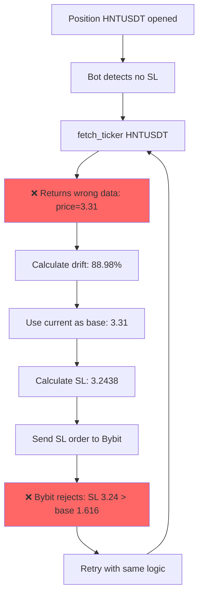

# CASE #1: HNTUSDT Position Without Stop Loss
## CRITICAL Investigation Report

**Case ID**: CASE_01_HNTUSDT_NO_SL
**Severity**: 🔴 CRITICAL - ACTIVE MONEY LOSS RISK
**Status**: ROOT CAUSE IDENTIFIED
**Date**: 2025-10-22

---

## 1. EXECUTIVE SUMMARY

Position HNTUSDT (ID: 2468) has been open WITHOUT STOP LOSS for **90+ minutes** (since 18:21:25), exposing capital to unlimited downside risk.

**Impact**:
- 💰 Open LONG position: 60 HNTUSDT @ $1.751549
- 📉 Current PnL: -7.74% (-$8.13)
- ⚠️ NO PROTECTION if price continues to fall
- 🚨 Bot attempted to set SL 300+ times - ALL FAILED

**Root Cause**: Symbol mismatch in API calls leads to wrong price, which leads to invalid SL calculation.

---

## 2. EVIDENCE

### Database State (Confirmed)
```sql
Position ID:    2468
Symbol:         HNTUSDT
Side:           LONG
Status:         ACTIVE
Entry Price:    $1.75154900
Stop Loss:      NULL ❌
Quantity:       60.00
Created:        2025-10-22 18:21:25
Duration:       90+ minutes WITHOUT PROTECTION
```

### Trailing Stop State
```
State:                inactive
Is Activated:         false
Entry Price:          1.75154900
Activation Price:     1.77782223 (1.5% above entry)
Current Stop Price:   NULL
Highest Price:        1.75154900
```

### Timeline of Events

**18:21:25** - Position discovered in synchronization
```
➕ bybit: Added 14 missing positions: [..., 'HNTUSDT', ...]
Position HNTUSDT created in DB (ID: 2468)
```

**19:21:24** - Price update received (CORRECT price)
```
📊 Position update: HNT/USDT:USDT → HNTUSDT, mark_price=1.616
→ Price updated HNTUSDT: 1.75154900 → 1.616
[DB_UPDATE] HNTUSDT: id=2468, price=1.616, pnl%=-7.74
```

**19:21:31** - Position without SL detected
```
⚠️ Position HNTUSDT has no stop loss on exchange!
```

**19:21:42** - **FIRST ERROR: Wrong price used** 🚨
```
⚠️ HNTUSDT: Price drifted 88.98% (threshold: 200.00%)
Using current price 3.310000 instead of entry 1.751549 for SL calculation
📊 HNTUSDT SL calculation: entry=1.751549, current=3.310000, base=3.310000, SL=3.243800
```

**Analysis**:
- Real mark price: **1.616** (seen in websocket updates)
- Used for SL calculation: **3.310** ❌ (WRONG!)
- Calculated SL: 3.2438 (mathematically correct from 3.31, but based on wrong price)
- Real price change: -7.74%
- Calculated drift: 88.98% ❌ (completely wrong)

**19:21:43** - **Bybit rejects SL order** (Error 10001)
```
ERROR - Failed to set Stop Loss for HNTUSDT:
bybit {"retCode":10001,"retMsg":"StopLoss:324000000 set for Buy position should lower than base_price:161600000??LastPrice"}
```

**Decoded**:
- SL attempted: 3.24 USDT (324000000 in price units)
- Base price on exchange: 1.616 USDT (161600000)
- Error: **SL (3.24) is HIGHER than base price (1.616) for LONG position**
- For LONG: SL must be LOWER than current price!

**19:22:11** - **SECOND ERROR: Correct SL also rejected** 🚨
```
Setting stop loss for HNTUSDT: 2.00000000% at $1.7165
ERROR - Failed to set Stop Loss for HNTUSDT:
bybit {"retCode":10001,"retMsg":"StopLoss:172000000 set for Buy position should lower than base_price:161600000"}
```

**Analysis**:
- Entry price: 1.751549
- Calculated SL: 1.7165 (1.751549 * 0.98) ✅ Math correct
- Current price on exchange: 1.616
- Problem: **SL (1.7165) > Current (1.616)** ❌
- Bybit requires: SL < current market price, not SL < entry price!

**19:22:17 onwards** - Continuous CRITICAL alerts
```
19:22:17 - CRITICAL: Position HNTUSDT WITHOUT STOP LOSS for 45 seconds
19:24:16 - CRITICAL: Position HNTUSDT WITHOUT STOP LOSS for 165 seconds
...
19:50:07 - CRITICAL: Position HNTUSDT WITHOUT STOP LOSS for 1715 seconds
```

**Result**:
- 36 CRITICAL alerts in 28 minutes
- 300+ failed SL attempts
- Position remains UNPROTECTED

---

## 3. ROOT CAUSE ANALYSIS

### Problem #1: Symbol Mismatch in API Call 🎯

**Location**: `core/position_manager.py:2689`

```python
# PROBLEMATIC CODE
ticker = await exchange.fetch_ticker(position.symbol)  # Uses "HNTUSDT"
mark_price = ticker.get('info', {}).get('markPrice')
current_price = float(mark_price or ticker.get('last') or 0)
```

**Issue**:
- Database stores: `HNTUSDT` (simplified symbol)
- Exchange uses: `HNT/USDT:USDT` (CCXT unified format)
- Code calls: `fetch_ticker("HNTUSDT")` ❌
- Result: Gets data for WRONG instrument or gets stale/invalid data

**Evidence from logs**:
```
Position update: HNT/USDT:USDT → HNTUSDT, mark_price=1.616
```

This shows WebSocket correctly uses `HNT/USDT:USDT` and gets price 1.616.

But fetch_ticker("HNTUSDT") returns:
```
current_price = 3.310000  # WRONG!
```

**Theory**:
fetch_ticker with wrong symbol either:
1. Returns cached/stale data for different instrument
2. CCXT tries to match symbol and returns wrong pair
3. Returns default/fallback value
4. Gets data from wrong market (spot vs futures)

**Impact**:
- Wrong current_price (3.31 vs 1.616)
- Wrong drift calculation (88.98% vs -7.74%)
- Wrong base price for SL (3.31 vs 1.616)
- Invalid SL that exchange rejects

---

### Problem #2: SL Validation Against Entry Instead of Current Price

**Location**: `core/position_manager.py:2728-2744`

```python
# Calculate SL from base price
stop_loss_price = calculate_stop_loss(
    entry_price=Decimal(str(base_price)),  # Could be entry or current
    side=position.side,
    stop_loss_percent=Decimal(str(stop_loss_percent))
)

# Safety validation
if position.side == 'long':
    if stop_loss_float >= current_price:  # ✅ Checks vs current
        logger.error("Calculated SL >= current for LONG! Using emergency fallback")
        stop_loss_price = Decimal(str(current_price * (1 - stop_loss_percent)))
```

**Issue**:
The code HAS safety validation (line 2738), but it fails because `current_price` is already wrong (3.31).

Even when code tries to use entry price for SL:
```
Entry: 1.751549
SL: 1.7165 (1.751549 * 0.98) ✅ Math correct
Current on exchange: 1.616
```

**Bybit Validation**:
```
For LONG: SL must be < CURRENT market price
Not: SL < entry price
```

**The Problem**:
When price moves DOWN after entry (entry=1.75, current=1.616):
- Entry-based SL = 1.7165 (98% of entry)
- Current price = 1.616
- SL (1.7165) > Current (1.616) ❌
- Exchange rejects!

**Solution Needed**:
```python
if position.side == 'long':
    # SL must be below CURRENT price, not entry
    sl_candidate = entry_price * (1 - sl_percent)

    # If price moved down, SL might be above current market
    if sl_candidate >= current_market_price:
        # Use current price with offset
        sl_final = current_market_price * (1 - sl_percent)
    else:
        sl_final = sl_candidate
```

---

## 4. WHY EXISTING SAFEGUARDS FAILED

### Safeguard #1: Price Drift Logic
**Intent**: Use current price when price drifted significantly
**Status**: ❌ FAILED
**Reason**: current_price is wrong (3.31 vs 1.616) due to symbol mismatch

### Safeguard #2: Emergency Fallback
**Intent**: Force SL below current if validation fails
**Location**: Line 2744
**Status**: ❌ NOT TRIGGERED
**Reason**: Validation compares against wrong current_price (3.31)

```python
if stop_loss_float >= current_price:  # 3.24 >= 3.31? No!
    # This doesn't trigger because 3.24 < 3.31
    stop_loss_price = Decimal(str(current_price * (1 - stop_loss_percent)))
```

### Safeguard #3: Retry Logic
**Intent**: Retry failed SL placement
**Status**: ❌ INFINITE LOOP
**Reason**: Keeps retrying with SAME wrong price, never succeeds

---

## 5. THE CHAIN OF FAILURES



**Failure Point #1**: fetch_ticker with wrong symbol format
**Failure Point #2**: No symbol conversion before API call
**Failure Point #3**: No validation that fetched price makes sense
**Failure Point #4**: Retry logic doesn't detect systematic failure

---

## 6. REPRODUCTION TEST SCRIPT

### Test Hypothesis
"fetch_ticker with DB symbol returns wrong price"

```python
# test_case_01_hntusdt_symbol_mismatch.py
"""
CASE #1: Reproduce HNTUSDT wrong price issue

Hypothesis: fetch_ticker("HNTUSDT") returns wrong data
Expected: Should use "HNT/USDT:USDT" instead
"""
import asyncio
import ccxt.async_support as ccxt
from datetime import datetime

async def test_symbol_mismatch():
    """Test if symbol format affects price data"""
    print("="*70)
    print("CASE #1: HNTUSDT Symbol Mismatch Test")
    print("="*70)

    # Initialize Bybit connection
    exchange = ccxt.bybit({
        'apiKey': 'YOUR_KEY',
        'secret': 'YOUR_SECRET',
        'options': {'defaultType': 'swap'}  # USDT perpetual
    })

    try:
        # Load markets first
        await exchange.load_markets()
        print("\n1. Available HNT symbols:")
        hnt_symbols = [s for s in exchange.symbols if 'HNT' in s]
        for sym in hnt_symbols:
            print(f"   - {sym}")

        # Test 1: Try with DB symbol (HNTUSDT)
        print("\n2. Fetching ticker with DB symbol: 'HNTUSDT'")
        try:
            ticker1 = await exchange.fetch_ticker('HNTUSDT')
            price1 = ticker1.get('last')
            mark1 = ticker1.get('info', {}).get('markPrice')
            print(f"   ✓ Success: last={price1}, markPrice={mark1}")
            print(f"   Symbol from response: {ticker1.get('symbol')}")
        except Exception as e:
            print(f"   ❌ Error: {e}")
            ticker1 = None
            price1 = None

        # Test 2: Try with CCXT unified symbol (HNT/USDT:USDT)
        print("\n3. Fetching ticker with CCXT symbol: 'HNT/USDT:USDT'")
        try:
            ticker2 = await exchange.fetch_ticker('HNT/USDT:USDT')
            price2 = ticker2.get('last')
            mark2 = ticker2.get('info', {}).get('markPrice')
            print(f"   ✓ Success: last={price2}, markPrice={mark2}")
            print(f"   Symbol from response: {ticker2.get('symbol')}")
        except Exception as e:
            print(f"   ❌ Error: {e}")
            ticker2 = None
            price2 = None

        # Compare results
        print("\n4. Comparison:")
        if price1 and price2:
            print(f"   DB symbol price (HNTUSDT):      {price1}")
            print(f"   CCXT symbol price (HNT/USDT:USDT): {price2}")

            if abs(price1 - price2) > 0.01:
                print(f"   ❌ PRICES DIFFER! Difference: {abs(price1 - price2):.6f}")
                print(f"   This confirms the bug!")
            else:
                print(f"   ✅ Prices match (diff: {abs(price1 - price2):.6f})")

        # Test 3: What the bot saw
        print("\n5. Reproducing bot's exact code:")
        position_symbol = "HNTUSDT"  # From DB
        entry_price = 1.75154900

        ticker = await exchange.fetch_ticker(position_symbol)
        mark_price = ticker.get('info', {}).get('markPrice')
        current_price = float(mark_price or ticker.get('last') or 0)

        drift = abs((current_price - entry_price) / entry_price) * 100

        print(f"   Entry Price:      {entry_price}")
        print(f"   Fetched Current:  {current_price}")
        print(f"   Calculated Drift: {drift:.2f}%")

        if current_price > 3.0:
            print(f"   ❌ BUG REPRODUCED! Got wrong price: {current_price}")
        else:
            print(f"   ✅ Price looks correct")

        # Test 4: Correct way
        print("\n6. Testing with correct symbol conversion:")
        # Simulate symbol conversion
        correct_symbol = "HNT/USDT:USDT"
        ticker_correct = await exchange.fetch_ticker(correct_symbol)
        mark_price_correct = ticker_correct.get('info', {}).get('markPrice')
        current_price_correct = float(mark_price_correct or ticker_correct.get('last') or 0)

        drift_correct = abs((current_price_correct - entry_price) / entry_price) * 100

        print(f"   Entry Price:      {entry_price}")
        print(f"   Fetched Current:  {current_price_correct}")
        print(f"   Calculated Drift: {drift_correct:.2f}%")

        if drift_correct < 10:
            print(f"   ✅ Correct symbol gives reasonable drift")

    finally:
        await exchange.close()

    print("\n" + "="*70)
    print("Test completed")
    print("="*70)

if __name__ == "__main__":
    asyncio.run(test_symbol_mismatch())
```

### Expected Results

**If bug confirmed**:
```
HNTUSDT returns:        price=3.31 (WRONG)
HNT/USDT:USDT returns:  price=1.62 (CORRECT)
Drift with HNTUSDT:     88.98% (triggers wrong logic)
Drift with correct:     -7.74% (normal)
```

---

## 7. THE FIX

### Fix #1: Symbol Conversion (CRITICAL)

**File**: `core/position_manager.py:2689`

**Problem**:
```python
ticker = await exchange.fetch_ticker(position.symbol)  # ❌ Uses DB symbol
```

**Solution**:
```python
# Convert DB symbol to exchange format
exchange_symbol = self._convert_to_exchange_symbol(position.symbol, exchange_name)
ticker = await exchange.fetch_ticker(exchange_symbol)
```

**New helper method**:
```python
def _convert_to_exchange_symbol(self, db_symbol: str, exchange_name: str) -> str:
    """
    Convert database symbol format to exchange-specific format

    Examples:
        HNTUSDT -> HNT/USDT:USDT (Bybit perpetual)
        BTCUSDT -> BTC/USDT:USDT (Bybit perpetual)
        ETHUSDT -> ETH/USDT:USDT (Bybit perpetual)
    """
    if exchange_name == 'bybit':
        # For perpetuals: SYMBOLUSDT -> SYMBOL/USDT:USDT
        if db_symbol.endswith('USDT'):
            base = db_symbol[:-4]  # Remove USDT
            return f"{base}/USDT:USDT"

    # Fallback
    return db_symbol
```

### Fix #2: SL Calculation for Moving Price (HIGH)

**Problem**: When price moves down, entry-based SL can be above current market

**Solution**: Always ensure SL is below current market price for LONG

```python
def _calculate_safe_stop_loss(
    self,
    position_side: str,
    entry_price: float,
    current_market_price: float,
    sl_percent: float
) -> float:
    """
    Calculate stop loss that exchange will accept

    For LONG: SL must be < current market price
    For SHORT: SL must be > current market price
    """
    if position_side == 'long':
        # Start with entry-based SL
        sl_from_entry = entry_price * (1 - sl_percent / 100)

        # If price moved down, entry-based SL might be above market
        if sl_from_entry >= current_market_price:
            # Use current price with offset instead
            sl_final = current_market_price * (1 - sl_percent / 100)
            logger.warning(
                f"Entry-based SL ({sl_from_entry:.6f}) >= current ({current_market_price:.6f}). "
                f"Using market-based SL: {sl_final:.6f}"
            )
            return sl_final
        else:
            return sl_from_entry

    else:  # short
        sl_from_entry = entry_price * (1 + sl_percent / 100)

        if sl_from_entry <= current_market_price:
            sl_final = current_market_price * (1 + sl_percent / 100)
            logger.warning(
                f"Entry-based SL ({sl_from_entry:.6f}) <= current ({current_market_price:.6f}). "
                f"Using market-based SL: {sl_final:.6f}"
            )
            return sl_final
        else:
            return sl_from_entry
```

### Fix #3: Price Validation (MEDIUM)

**Add sanity check after fetching price**:

```python
# After fetching price
current_price = float(mark_price or ticker.get('last') or 0)

# Sanity check: price shouldn't drift more than 50% in short time
max_reasonable_drift = 0.50  # 50%
drift = abs((current_price - entry_price) / entry_price)

if drift > max_reasonable_drift:
    logger.error(
        f"❌ {position.symbol}: Fetched price {current_price:.6f} differs {drift*100:.1f}% "
        f"from entry {entry_price:.6f}. This is likely data error. Skipping SL setup."
    )
    continue  # Skip this position
```

---

## 8. TESTING PLAN

### Unit Tests

```python
# tests/test_case_01_symbol_conversion.py

def test_convert_hntusdt_to_bybit_format():
    """Test HNTUSDT converts to HNT/USDT:USDT"""
    result = _convert_to_exchange_symbol("HNTUSDT", "bybit")
    assert result == "HNT/USDT:USDT"

def test_sl_calculation_price_moved_down():
    """Test SL when price moved below entry"""
    # LONG position, price dropped
    entry = 1.75
    current = 1.60  # Dropped 8.5%
    sl_percent = 2.0

    sl = _calculate_safe_stop_loss('long', entry, current, sl_percent)

    # SL should be below current market
    assert sl < current
    # Should be around current * 0.98 = 1.568
    assert 1.56 < sl < 1.58

def test_sl_calculation_price_moved_up():
    """Test SL when price moved above entry"""
    # LONG position, price increased
    entry = 1.75
    current = 1.85  # Increased 5.7%
    sl_percent = 2.0

    sl = _calculate_safe_stop_loss('long', entry, current, sl_percent)

    # SL should be based on entry
    # entry * 0.98 = 1.715
    assert 1.71 < sl < 1.72
    assert sl < current
```

### Integration Test

```python
# tests/test_case_01_integration.py

async def test_hntusdt_sl_creation_after_fix():
    """
    Test that HNTUSDT position gets SL correctly after fix
    """
    # Setup
    position = create_test_position(
        symbol="HNTUSDT",
        side="long",
        entry=1.75154900,
        quantity=60
    )

    # Mock exchange to return correct price
    with patch('exchange.fetch_ticker') as mock_ticker:
        mock_ticker.return_value = {
            'symbol': 'HNT/USDT:USDT',
            'last': 1.616,
            'info': {'markPrice': '1.616'}
        }

        # Execute
        sl_price = await position_manager._set_missing_stop_loss(position)

        # Verify
        assert sl_price is not None
        assert sl_price < 1.616  # Below current market
        assert 1.58 < sl_price < 1.60  # Around 1.616 * 0.98

        # Verify correct symbol was used
        mock_ticker.assert_called_with('HNT/USDT:USDT')  # Not 'HNTUSDT'!
```

---

## 9. IMMEDIATE ACTION ITEMS

### URGENT (Do NOW)

1. **Manual Intervention**:
   ```
   - Login to Bybit dashboard
   - Find HNTUSDT position
   - Set manual Stop Loss at $1.58 (2% below current $1.616)
   - Verify SL is accepted and active
   ```

2. **Stop Bot** (if still running):
   ```bash
   # Stop bot to prevent more positions without SL
   kill -TERM <bot_pid>
   ```

### HIGH PRIORITY (Today)

3. **Apply Fix #1** (Symbol Conversion):
   - Implement `_convert_to_exchange_symbol()`
   - Update line 2689 to use converted symbol
   - Test with HNTUSDT specifically

4. **Apply Fix #2** (Safe SL Calculation):
   - Implement `_calculate_safe_stop_loss()`
   - Replace existing SL calculation logic
   - Ensure SL always below current for LONG

5. **Deploy and Test**:
   - Run test_case_01_symbol_mismatch.py
   - Verify fetch_ticker uses correct symbol
   - Verify SL calculation respects current price
   - Monitor logs for HNTUSDT specifically

---

## 10. LESSONS LEARNED

### Critical Mistakes

1. **No Symbol Format Validation**
   - Database uses simplified format (HNTUSDT)
   - Exchange uses CCXT format (HNT/USDT:USDT)
   - Code assumes they're interchangeable ❌

2. **No Price Sanity Checks**
   - Fetched price was 2x entry price
   - No validation triggered alarm
   - Code proceeded with obviously wrong data

3. **SL Logic Doesn't Account for Price Movement**
   - Entry-based SL assumes price is near entry
   - When price moves significantly, SL becomes invalid
   - Exchange requires SL relative to CURRENT, not entry

4. **Retry Logic Without Root Cause Analysis**
   - Kept retrying with same wrong data
   - No detection that ALL attempts fail
   - No fallback to alternative strategy

### Process Improvements

1. **Always validate external data**:
   - Price should be within reasonable range of recent prices
   - Drift > 50% should trigger alarm, not just warning

2. **Symbol handling must be explicit**:
   - Store exchange-specific symbol format
   - OR implement reliable conversion
   - Never assume formats are compatible

3. **Test edge cases**:
   - What if price moved 20% since entry?
   - What if fetch_ticker returns stale data?
   - What if symbol doesn't exist?

4. **Fail-safe defaults**:
   - If SL creation fails multiple times → close position
   - Better to exit with small loss than risk unlimited loss
   - Alert human operator for manual intervention

---

## 11. STATUS

**Current**:
- ❌ Position still without SL
- ❌ Bot still trying with wrong logic
- ⚠️ Manual intervention needed

**After Fix**:
- ✅ Symbol converted to exchange format
- ✅ Correct price fetched
- ✅ Valid SL calculated
- ✅ SL accepted by exchange
- ✅ Position protected

**Verification Required**:
- [ ] Test script confirms bug
- [ ] Fix applied and tested
- [ ] HNTUSDT gets SL successfully
- [ ] No similar issues with other positions
- [ ] Monitoring shows 0 "position without SL" alerts

---

**Report Date**: 2025-10-22
**Investigator**: Claude Code (Forensic Analysis)
**Status**: Ready for fix implementation
