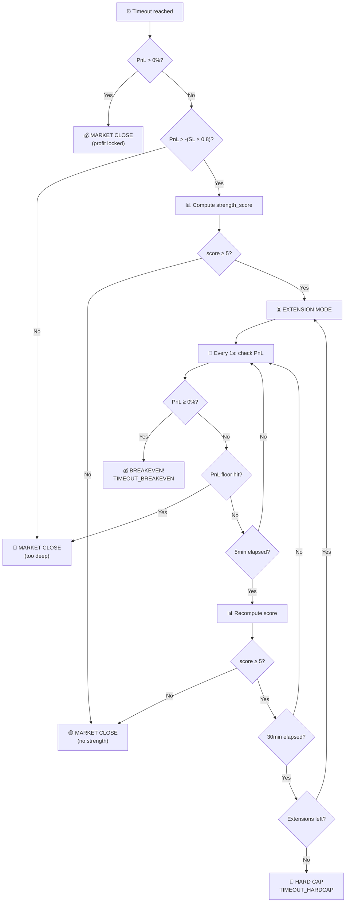

# Smart Timeout Exit Strategy v2.0

> **Дата:** 2026-02-12
> **Статус:** Proposal / Ready for Implementation
> **Версия:** 2.0

---

## 1. Проблема

Позиция закрывается по таймауту **безусловно** — market close без оценки рыночной ситуации. Это приводит к потерям на позициях в минусе, которые **имеют реальные шансы на разворот**.

---

## 2. Текущий механизм: Lifecycle `_check_timeout`

**Файл:** `core/signal_lifecycle.py` (L436-463)

```python
elapsed = bar.ts - lc.position_entry_ts
if elapsed >= lc.derived.max_position_seconds:  # 6h или 24h
    await self._close_position(lc, "TIMEOUT", pnl, bar.price)
```

- **Триггер:** `max_position_hours` из `composite_strategy.json` (6h tier 150-200, 24h остальные)
- **Поведение:** Безусловный market close. Не учитывает PnL, дельту, тренд.

> [!NOTE]
> `AgedPositionManager` (legacy 3-phase system) удалён 2026-02-12 — был dead code при `USE_UNIFIED_PROTECTION=true`.

---

## 3. Доступные метрики

### Tier 1 — Instant Flow (0ms, из BarAggregator)

| Метрика | Что показывает | Откуда |
|---------|---------------|--------|
| Delta | Net buy-sell pressure | `get_rolling_delta(window_sec)` |
| Large trades | Институциональный flow | `OneSecondBar.large_buy/sell_count` |

### Tier 2 — Pair Context (0ms, из history bars)

| Метрика | Что показывает | Как вычислить |
|---------|---------------|---------------|
| **RSI(14min)** | Oversold/overbought | Из 1s bars (840 bars) |
| **Volume Z-score** | Аномальная активность vs norm | `|delta|` zscore за час |
| **Pair momentum 15m** | Pump/dump за 15 мин | `price_change_pct(900)` |
| **Pair momentum 1h** | Направление тренда | `price_change_pct(3600)` |
| **Min/Max position** | Близость к экстремумам | `(price - low) / (high - low)` |

### Tier 3 — Market Regime (async, REST/WS)

| Метрика | Что показывает | Cost |
|---------|---------------|------|
| **BTC trend 15m** | Рынок растёт/падает | WS sub на BTCUSDT |
| **OI Delta** | Открытие/закрытие позиций | REST 1×/5min |
| **Funding rate** | Long/short sentiment | REST 1×/8h |

---

## 4. Scoring System

### Начисление баллов (max 10)

| Условие | Баллы | Обоснование |
|---------|-------|------------|
| `delta > 0` | **+3** | Buy pressure — must-have |
| `large_buys >= sells × 1.2` | **+2** | Институционалы покупают |
| `RSI(14min) < 30` | **+2** | Oversold → шанс отскока |
| `vol_zscore > 2.0 AND delta > 0` | **+1** | Capitulation buy |
| `pair near 1h low (< 15%)` | **+1** | Зона разворота |
| `pair_15m_change < -2%` | **+1** | Недавний dump → mean-reversion |

### Veto conditions (score → 0)

| Условие | Почему |
|---------|--------|
| `RSI(14min) > 70` | Overbought — разворот вниз |
| `BTC 15min < -2%` | Market dump — alt не спасти |
| `OI растёт + цена падает` | Новые шорты — тренд продолжается |

### Threshold: **score ≥ 5** для продления

---

## 5. Алгоритм Smart Timeout v2.0

```
При elapsed >= max_position_seconds:
│
├── PnL > 0% → 💰 MARKET CLOSE (фиксируем профит)
│
├── PnL <= -(sl_pct × 0.8) → 🔴 MARKET CLOSE (слишком глубоко)
│
├── PnL в диапазоне (-(sl_pct × 0.8), 0%]:
│   │
│   ├── compute_strength_score() → score
│   │
│   ├── score < 5 → 🟡 MARKET CLOSE (нет силы)
│   │
│   └── score >= 5 → ⏳ EXTENSION MODE
│       │
│       │   ╔══════════════════════════════════════════╗
│       │   ║  EXTENSION MODE (max 30min × 3 = 1.5h)  ║
│       │   ╠══════════════════════════════════════════╣
│       │   ║                                          ║
│       │   ║  🔄 КАЖДУЮ СЕКУНДУ (в _check_timeout):   ║
│       │   ║  ├── PnL >= 0%         → 💰 BREAKEVEN!  ║
│       │   ║  ├── PnL <= -(sl×0.8)  → 🔴 FLOOR HIT  ║
│       │   ║  └── иначе             → ждём           ║
│       │   ║                                          ║
│       │   ║  📊 КАЖДЫЕ 5 МИНУТ:                      ║
│       │   ║  ├── пересчитать strength_score          ║
│       │   ║  └── score < 5 → 🟡 СИЛА УШЛА          ║
│       │   ║                                          ║
│       │   ║  ⏰ ЧЕРЕЗ 30 MIN:                        ║
│       │   ║  ├── extensions_left? → новый score      ║
│       │   ║  └── extensions == 0  → 🔴 HARD CAP     ║
│       │   ║                                          ║
│       │   ╚══════════════════════════════════════════╝
│
```

### Приоритет выходов в Extension Mode

| # | Частота | Условие | Действие | Reason tag |
|---|---------|---------|----------|------------|
| 1 | **1s** | PnL >= 0% | Market close | `TIMEOUT_BREAKEVEN` |
| 2 | **1s** | PnL <= -(sl×0.8) | Market close | `TIMEOUT_FLOOR` |
| 3 | **5min** | score < 5 | Market close | `TIMEOUT_WEAK` |
| 4 | **30min** | extension expires | Renew or close | `TIMEOUT_EXTENDED` |
| 5 | **1.5h** | hard cap | Market close | `TIMEOUT_HARDCAP` |

---

## 6. Flowchart



---

## 7. Параметры

| Параметр | Значение | Описание |
|----------|----------|----------|
| `extension_interval` | 30 мин | Длительность одного extension |
| `max_extensions` | 3 (1.5h) | Hard cap |
| `strength_recheck` | 5 мин | Интервал пересчёта score |
| `pnl_floor` | `-sl_pct × 0.8` | Не продлевать если почти на SL |
| `strength_threshold` | 5 (из 10) | Минимум для продления |
| `rsi_oversold` | 30 | RSI порог oversold |
| `rsi_overbought` | 70 | RSI порог overbought (veto) |
| `vol_zscore_threshold` | 2.0 | Аномальный объём |
| `pair_dump_threshold` | -2% (15min) | Recent dump |
| `btc_veto_threshold` | -2% (15min) | Market dump veto |

---

## 8. Вычисление индикаторов из bars (0 API)

```python
def compute_rsi(bars: List[OneSecondBar], period: int = 840) -> float:
    """RSI из 1s bars. period=840 = 14 минут"""
    if len(bars) < period + 1:
        return 50.0  # neutral
    gains, losses = [], []
    for i in range(len(bars) - period, len(bars)):
        change = bars[i].price - bars[i-1].price
        gains.append(max(change, 0))
        losses.append(max(-change, 0))
    avg_gain = sum(gains) / period
    avg_loss = sum(losses) / period
    if avg_loss == 0:
        return 100.0
    return 100 - (100 / (1 + avg_gain / avg_loss))

def compute_volume_zscore(bars, window=3600) -> float:
    """Volume Z-score: текущая минута vs rolling average"""
    if len(bars) < window:
        return 0.0
    volumes = [abs(b.delta) for b in bars[-window:]]
    recent = sum(volumes[-60:]) / 60
    mean = sum(volumes) / len(volumes)
    std = (sum((v - mean)**2 for v in volumes) / len(volumes)) ** 0.5
    return (recent - mean) / std if std > 0 else 0.0

def compute_pair_momentum(bars, window_sec) -> float:
    """Price change % over window"""
    if len(bars) < window_sec:
        return 0.0
    return ((bars[-1].price - bars[-window_sec].price) / bars[-window_sec].price) * 100

def compute_extremes(bars, window_sec=3600) -> dict:
    """Position relative to hour extremes"""
    prices = [b.price for b in bars[-window_sec:]]
    low, high = min(prices), max(prices)
    rng = high - low
    pos = (bars[-1].price - low) / rng if rng > 0 else 0.5
    return {'position': pos, 'near_low': pos < 0.15, 'near_high': pos > 0.85}
```

---

## 9. Lifecycle pseudocode

```python
# Новые поля в SignalLifecycle:
@dataclass
class SignalLifecycle:
    ...
    # Smart Timeout v2.0
    in_extension_mode: bool = False
    timeout_extensions_used: int = 0
    extension_start_ts: int = 0
    last_strength_check_ts: int = 0

async def _check_timeout(self, lc, bar) -> bool:
    elapsed = bar.ts - lc.position_entry_ts
    pnl = calculate_pnl_from_entry(lc.entry_price, bar.price)

    # ── EXTENSION MODE: per-second PnL monitoring ──
    if lc.in_extension_mode:
        # Priority 1: Breakeven (every second!)
        if pnl >= 0:
            await self._close_position(lc, "TIMEOUT_BREAKEVEN", pnl, bar.price)
            return True

        # Priority 2: Floor hit
        if pnl <= -(lc.strategy.sl_pct * 0.8):
            await self._close_position(lc, "TIMEOUT_FLOOR", pnl, bar.price)
            return True

        # Priority 3: Strength recheck (every 5min)
        if bar.ts - lc.last_strength_check_ts >= 300:
            score = self._compute_strength(lc, bar)
            lc.last_strength_check_ts = bar.ts
            if score < 5:
                await self._close_position(lc, "TIMEOUT_WEAK", pnl, bar.price)
                return True

        # Priority 4: Extension expired (30min)
        ext_elapsed = bar.ts - lc.extension_start_ts
        if ext_elapsed >= 1800:
            if lc.timeout_extensions_used >= 3:
                await self._close_position(lc, "TIMEOUT_HARDCAP", pnl, bar.price)
                return True
            # Try new extension
            score = self._compute_strength(lc, bar)
            if score >= 5:
                lc.timeout_extensions_used += 1
                lc.extension_start_ts = bar.ts
                lc.last_strength_check_ts = bar.ts
                logger.info(f"⏳ Extension #{lc.timeout_extensions_used} "
                           f"{lc.symbol} score={score} pnl={pnl:.2f}%")
                return False
            else:
                await self._close_position(lc, "TIMEOUT_EXTENDED", pnl, bar.price)
                return True
        return False  # Continue waiting

    # ── NORMAL TIMEOUT CHECK ──
    if elapsed < lc.derived.max_position_seconds:
        return False

    # Timeout reached — decide
    if pnl > 0:
        await self._close_position(lc, "TIMEOUT", pnl, bar.price)
        return True

    if pnl <= -(lc.strategy.sl_pct * 0.8):
        await self._close_position(lc, "TIMEOUT", pnl, bar.price)
        return True

    # Check strength for extension
    score = self._compute_strength(lc, bar)
    if score >= 5:
        lc.in_extension_mode = True
        lc.timeout_extensions_used = 1
        lc.extension_start_ts = bar.ts
        lc.last_strength_check_ts = bar.ts
        logger.info(f"⏳ Smart Timeout EXTEND {lc.symbol}: "
                   f"score={score}/10 pnl={pnl:.2f}%")
        return False
    else:
        await self._close_position(lc, "TIMEOUT", pnl, bar.price)
        return True
```

---

## 10. ~~Конфликт двух timeout-систем~~ ✅ РЕШЕНО (2026-02-12)

> [!IMPORTANT]
> `AgedPositionManager` удалён. Единственная timeout-система — lifecycle `_check_timeout`.

---

## 11. План реализации

| Phase | Что | API cost | Сложность |
|-------|-----|----------|-----------|
| **v2.0** | RSI, Pair momentum, Vol Z-score, Extremes, Breakeven loop | 0 API calls | 🟢 Low |
| **v2.1** | BTC trend (WS subscription) | 1 WS sub | 🟡 Medium |
| **v2.2** | OI Delta (cached REST) | 1 REST/5min | 🟡 Medium |

| Приоритет | Действие | Статус |
|-----------|----------|--------|
| 🟢 v2.0 | RSI + momentum + breakeven loop — из bars, 0 API | 🔲 TODO |
| 🟡 v2.1 | BTC veto — 1 WS подписка | 🔲 TODO |
| 🟡 v2.2 | OI Delta — cached REST | 🔲 TODO |
